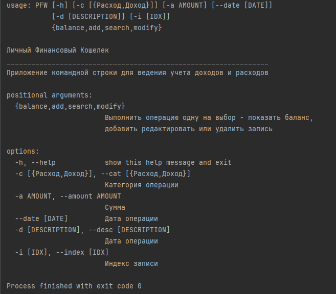
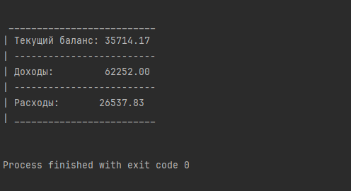
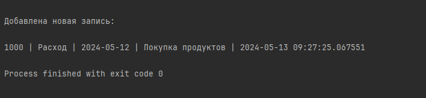
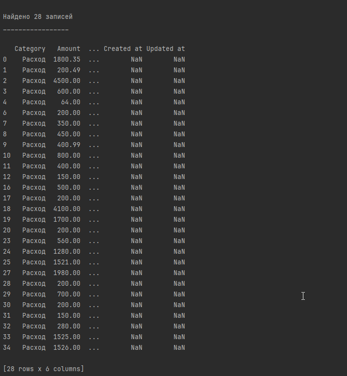
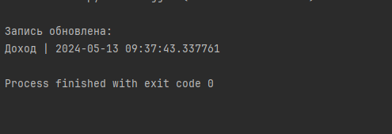

# Приложение командной строки Персональный Финансовый Кошелек

Приложение позволяет вести учет доходов и расходов и хранить информацию в файле xlsx. Вы можете 
вносить записи о доходах и расходах, добавлять новые, искать и редактировать существующие записи.

Приложение использует библиотеку argparse для парсинга аргументов командной строки, и
pandas для представления данных.

## Установка

Скопируйте папку проекта в нужную директорию и создайте виртуальную среду разработки. Далее установите
зависимости:

```commandline
pip install -r requirements.txt
```

Приложение автоматически проверит наличие директории database в корне проекта и файл xlsx в ней,
если они не существуют то создаст их автоматически. Также Вы можете создать их самостоятельно, тогда
этот шаг будет пропущен.

## Базовое использование

1. Для того, чтобы увидеть список доступных комманд, введите:

```commandline
python pfw.py -h
```



2. Чтобы посмотреть баланс, а также увидеть суммы доходов и расходов,
   введите:

```commandline
python pfw.py balance
```



3. Чтобы добавить новую запись, введите:

```commandline
python pfw.py add -c Расход -a 1000 --date 2024-05-12 -d "Покупка продуктов"
```



4. Чтобы найти запись, введите команду "search" и добавьте к ней значения
ячеек в качестве аргументов, по которым будет выполняться поиск. Возможен поиск по
нескольким условиям:

```commandline
search -c Расход
```



5. Чтобы редактировать запись, нужно указать ее индекс. Его
можно узнать по предыдущей команде, так как она выводит записи 
вместе с их индексами. Также необходимо передать в аргументах
новые значения для ячейки/ячеек. Например, запись с индексом 0:

```commandline
modify -i 0 -c Доход
```



В консоль будут выведены только обновленные ячейки и их новые значения